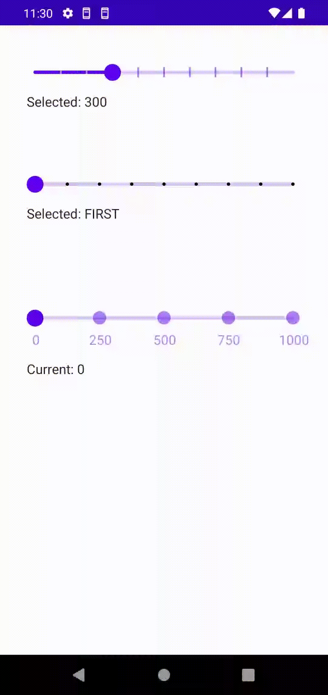

# Discrete-Slider

Jetpack Compose discrete slider (seekbar) widget implementation with customisable tick marks.


## Setup

### Setup with Gradle

Add this to your dependency repositories:
> maven { url "https://repo.repsy.io/mvn/davidzhubrev/compose-artifacts" }

And in your module build.gradle file:
> implementation 'com.appdav.composables:discrete-slider:1.0'

Or if you use build.gradle.kts:
> implementation "com.appdav.composables:discrete-slider:1.0"

## Usage:

This library provides generic collection slider, which takes in collection of element, current
element and onSelected callback. Here is example for CollectionSlider usage with enumeration class:

```
enum class TestEnum {
    FIRST,
    SECOND,
    THIRD,
    ...
}

...
//This is placed inside some composable scope:
Column(Modifier.padding(32.dp)) {
    val collection = remember { TestEnum.values().toList() }
    val (current, setCurrent) = remember { mutableStateOf(collection.first()) }
    CollectionSlider(
        collection = collection,
        selected = current,
        onSelected = setCurrent
    )
    Text("Selected: ${current.name}")
}
...
```

If you want to use some tick marks and change color, you can do it like this:

```
CollectionSlider(
    collection = collection,
    selected = current,
    onSelected = setCurrent,
    tickMark = TickMark.Dot(2.dp),
    colors = SliderDefaults.colors(
        activeTickColor = Color.Transparent,
        inactiveTickColor = Color.Black
    )
)  
```

Also there is special IntProgressionSlider, which takes in IntProgression instance:

```
val intProgression = remember { 0..1000 step 100 }
val (current, setCurrent) = remember { mutableStateOf(intProgression.first) }
IntProgressionSlider(
    progression = intProgression,
    selected = current,
    onSelected = setCurrent,
    tickMark = TickMark.Line(strokeWidth = 2.dp, height = 6.dp)
)
```

There are two types of TickMarks available at this point: Dot and Line. If you want to create your
own TickMark type, you can extend from CustomMark or use special function:

```
CustomMark(size: Dp, draw: DrawScope.(color: Color, xPosition: Float, indexInfo: IndexInfo) -> Unit)
```

When overriding drawElement method, one should consider that this method is called for every single
tick mark. Tick mark data is contained inside IndexInfo class, which contains collection of all
input collection indices, currently drawn tick mark index and currently selected by user element
index. Also there is canvasHeight value that needs overriding, its value is used to create extra
padding when drawing tick marks, for example, underneath the slider itself. Here is example of
creating CustomMark with numbers underneath the slider:

```
...
val paint = remember {
    android.graphics.Paint().apply {
    textSize = paintTextSize
    color = 0x000000
  }
}
IntProgressionSlider(
  progression = progression,
  selected = current,
  onSelected = { current = it },
  tickMark = TickMark.CustomMark(100.dp) { color, xPosition, indexInfo ->
      val verticalPadding = 32.dp.toPx()
      val yPosition = size.height / 2 + verticalPadding
      drawContext.canvas.nativeCanvas.apply {
          val text = progression.elementAt(indexInfo.currentIndex).toString()
          paint.color = color.toArgb()
          val bounds = Rect()
          paint.getTextBounds(text, 0, text.length, bounds)
          drawText(
              text,
              xPosition - bounds.width() / 2,
              yPosition,
              paint.also { it.color = color.toArgb() })
      }
      drawCircle(color, 8.dp.toPx(), Offset(xPosition, size.height / 2))
  },
  colors = SliderDefaults.colors(
      activeTickColor = MaterialTheme.colors.primary.copy(alpha = 0.5f),
      inactiveTickColor = MaterialTheme.colors.primary.copy(alpha = 0.5f)
  )
) 
...
```

